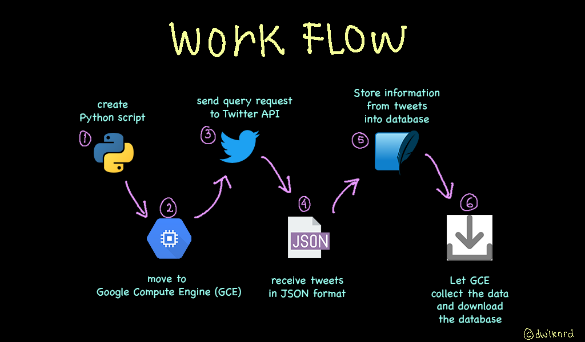

# Streaming Twitter Tweets and Create a Database using Python and SQLite3
<hr>

## 💠 &nbsp;Introduction
Data engineers gather the unstructured or semi-structured data from various sources and store them in a structured format in databases. We prepare the data for model building required by the data scientists. 
In this project I will work with a project of analysing streaming tweets. From extracting data from the source and storing it into a database to processing that data and preparing it for analysis tasks. **Through this project I will try to understand the workflow of a data engineer's task.**

## 📢 &nbsp;Audiences
For data engineer who want to create structured data from humungous data (has lots of insights and hidden stored within it) for data scientist needed. 

## ✅ &nbsp;What to Achieve
Every domain from stock markets and social media platform to IoT devices are producing thousand of rows of data in a matter of seconds. But, often this data is of immense importance in real-time. This streamed data can either be analysed in real-time or can be stored and analysed later. Therefore, it becomes imperative for every data scientist to understand how to handle real-time or streaming data. And what better streaming data than Twitter which produces millions of Tweets every hour.<br>
Twitter is a treasure trove of data. We can extract information from this. **If we can analyse streaming tweets we can understand the feelings of the people about events happening in the present. Business can leverage this information about how the public is reacting to their product. Investors can determine how a stock is going to perform** and so much more.

## 🛠 &nbsp;Tools

\
\
\
\
\


## 📝 &nbsp;Work Flow
<p align="center">
  
</p>

<hr>

## Create Python Script
The first thing we have to do is create a python script that contains code to get content from twitter into write to the database. The following are the steps we have to do in our python script
### Installing Relevan Libraries
We need install two og the following things for this project:
- **tweepy** library to stream the Tweets
[Tweepy](https://docs.tweepy.org/en/latest/) is a great library to access the Twitter API. Using Tweepy you can either stream tweets from your timeline, a specific user’s timeline, or simply search for the specific keyword! All using simple and elegant in-built functions.It is pretty straightforward to install Tweepy. You can either use pip to install Tweepy:<br>

```
pip install tweepy
```

- [**sqlite3**](https://docs.python.org/3/library/sqlite3.html) database to store the Tweets data
There are a great number of python modules that provide functionalities to work with databases of all variants and flavors. For a sqlite3 database, we may form a connection using `sqlite3` or one of many other alternatives.<br>
We can then use `pd.read_sql_query()`, passing in the connection:
```
sales = pd.read_sql_query("SELECT * FROM sales", conn)
```

Under the hood, `pandas` uses SQLAlchemy so any database supported by that library will work. This isn't something you need to worry about at this stage of your learning journey, but for the sake for practice, let's also see how a connection URI for a SQLite database looks like:

### Creating Twitter Developer Account
To stream data from Twitter, you will need to head over to the [Twitter developer’s website](https://developer.twitter.com/en/apply-for-access) and register your app to get access to the Twitter APIs. The steps are pretty straightforward. However, you need to provide a good explanation as to what you are going to do with the data you receive from Twitter. Hence, this might take a while, but you should be able to get this done pretty easily.
<br>
Once you have done this, head over to the dashboard and give a name to your app. Then access the Access token and generate Access Token Secret key. You will need these two keys as well to connect to the API.

### Authenticating the Twitter API
Firstly we need to create an OAuthHandler instance that handles the authentication. To do this, you need to pass the API key, API secret key, and Access token that you saved after setting up your Twitter app.

Besides this, you will also need the Access Token Secret key which you can generate by logging into your developer account and generating one for the Twitter app that you created. Once you have done that, you can finally create the API object by passing in the authentication information.

```
api_key = config('api_key') # api_key
api_secret_key = config('api_secret_key') # api_secret_key
access_token = config('access_token') # access_token
access_token_secret = config('access_token_secret') # access_token_secret

# authorize the API Key
authentication = tweepy.OAuthHandler(api_key, api_secret_key)

# authorization to user's access token and access token secret
authentication.set_access_token(access_token, access_token_secret)

# call the api
api = tweepy.API(authentication)
```

### Streaming Tweets in Real-Time

### Connecting to the Database
Whenever a tweet needs to be saved to the database, we will first open a connection to the database, execute the SQL command to the database, commit the changes, and finally close the connection. This is what is happening in the `insert_to_db()` method below.
```
def insert_to_db(tweet_id, username, tweet_text, date, hashtag):
    con = sqlite3.connect('streaming_tweets.db')
    cur = con.cursor()

    command = f'''INSERT INTO tweets VALUES ("{tweet_id}","{username}","{tweet_text}","{date}","{hashtag}")'''
    print(command)
    # insert user information
    try:
        cur.execute(command)
    except:
        print("there is error occur")
    # Save (commit) the changes
    con.commit()

    # We can also close the connection if we are done with it.
    # Just be sure any changes have been committed or they will be lost.
    con.close()
```
### Streaming Tweets into Database
We have set up how we will stream tweets in real-time and how we will store them in the database. Now, it is time to call the Streaming API and store those tweets in the database. To do that we need to first create an instance of our `**MyStreamListener()**` class. This instance along with our API authentication will be passed to tweepy. `**stream()**` method. Finally, we can filter the keywords we want to receive by using the `**filter()**` method on the instance returned by `**tweepy.Stream()**`.
```
myStreamListener = MyStreamListener()
myStream = tweepy.Stream(auth=api.auth, listener=myStreamListener,
                        tweet_mode="extended")
myStream.filter(track=['covid','Covid','COVID','covid19','Covid19','COVID19','covid-19','Covid-19','COVID-19'])
```
The `**tweet_mode**` argument specifies whether you want to access the tweets in extended mode or not.

## Move to Google Compute Engine (GCE)
Because to stream the tweets, we have to run the code that we want to correct continuously as we want. Here we will use a computer provided by [**Google Cloud Platform (GCP)**](https://console.cloud.google.com/getting-started?_ga=2.119931144.1208594536.1627550873-6334282.1626857023&_gac=1.90979048.1627550873.CjwKCAjwo4mIBhBsEiwAKgzXOP2IODBf55W0L1KA3AEG0anmhHya1N5ZZpa5o0RUBHPpFbNo8rSq6hoC664QAvD_BwE&pli=1). By utilizing Google Compute Engine (GCE) allows us to rent a computer with the specifications we need. On the computer that we rent at GCE, we will run the python script that we created earlier.

From the process we did above we can let the code run even though our local computer is in shutdown position. So we just have to wait for our database to be filled with tweets data. Next we can download the database file that we have created.

<hr>

## 📝 End Notes
To summarize, we learned to stream tweets in real-time, store them in a database, and finally analyse streaming tweets. This was really a fun project to work on, hope you were able to get a glimpse of the responsibilities of a data engineer!

We can also develop this idea for other needs. I hope this project is useful.

___


